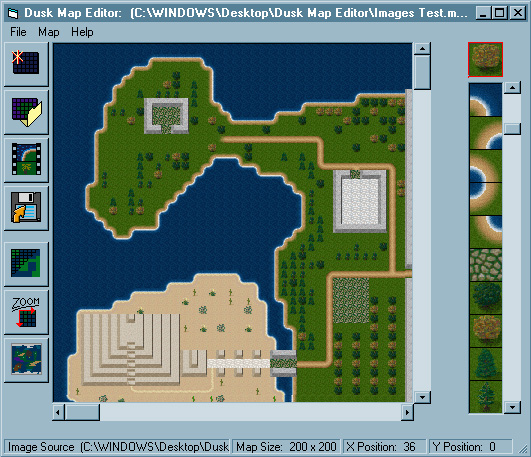



## Dusk Map Editor

### Description

The Dusk Map Editor is a program used to edit world maps used in Dusk. (Dusk is an open source JAVA based RPG game. See more info at: http://dusk.wesowin.org/)

This is a complete version, and demonstrates many capabilities such as: binary file open and save, picture manipulation, two dimensional array use, and other neat tricks and tips. For an application that doesnt have an ounce of API calls, it runs pretty smooth. Sorry for lack of code comments..

Included with the source code is a sample map, and sample image array which you can open and experiment with. I invite you to rip it appart and tear it up, so long as you get me a bit of feedback in return. Im always looking for better ways to do things.

Enjoy!
 
### More Info
 

             |
---                |---
**Submitted On**   |2001-06-24 12:10:42
**By**             |[Vince Soto](https://github.com/Planet-Source-Code/PSCIndex/blob/master/ByAuthor/vince-soto.md)
**Level**          |Intermediate
**User Rating**    |5.0 (35 globes from 7 users)
**Compatibility**  |VB 6\.0
**Category**       |[Complete Applications](https://github.com/Planet-Source-Code/PSCIndex/blob/master/ByCategory/complete-applications__1-27.md)
**World**          |[Visual Basic](https://github.com/Planet-Source-Code/PSCIndex/blob/master/ByWorld/visual-basic.md)
**Archive File**   |[Dusk Map E2162762420\.zip](https://github.com/Planet-Source-Code/vince-soto-dusk-map-editor__1-24392/archive/master.zip)

